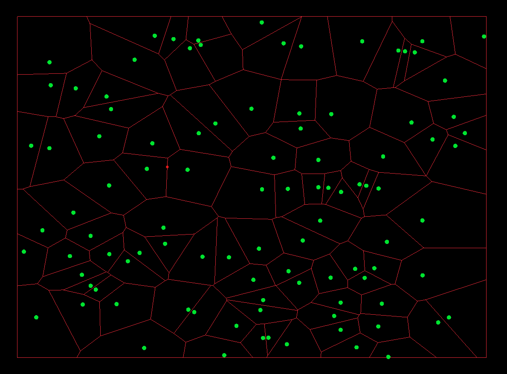

# FortuneAlgorithm

A C++ implementation of the Fortune's algorithm for Voronoi diagram construction.




## Build

The demo requires the [Raylib](https://www.raylib.com/) library.

Then you can build the project using [cmake](https://cmake.org/):

```
cmake -S . -B build
make --build build
```
Reference [link](https://pvigier.github.io/2018/11/18/fortune-algorithm-details.html)